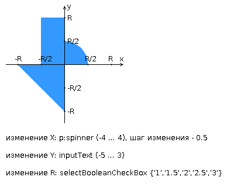

# Лабораторная работа #3
### Номер варианта: _9_

## Внимание! У разных вариантов разный текст задания!

__Изменения данных__
- изменение X: p:slider (-4 … 4), шаг изменения - 0.5
- изменение Y: inputText (-5 … 3)
- изменение R: selectBooleanCheckBox {'1', '1.5', '2', '2.5', '3'}

Разработать приложение на базе JavaServer Faces Framework, которое осуществляет проверку попадания точки в заданную область на координатной плоскости.

Приложение должно включать в себя 2 facelets-шаблона - стартовую страницу и основную страницу приложения, а также набор управляемых бинов (managed beans), реализующих логику на стороне сервера.

__Стартовая страница должна содержать следующие элементы:__
- "Шапку", содержащую ФИО студента, номер группы и номер варианта.
- Интерактивные часы, показывающие текущие дату и время, обновляющиеся раз в 6 секунд.
- Ссылку, позволяющую перейти на основную страницу приложения.

__Основная страница приложения должна содержать следующие элементы:__
- Набор компонентов для задания координат точки и радиуса области в соответствии с вариантом задания. Может потребоваться использование дополнительных библиотек компонентов - ICEfaces (префикс "ace") и PrimeFaces (префикс "p"). Если компонент допускает ввод заведомо некорректных данных (таких, например, как буквы в координатах точки или отрицательный радиус), то приложение должно осуществлять их валидацию.
- Динамически обновляемую картинку, изображающую область на координатной плоскости в соответствии с номером варианта и точки, координаты которых были заданы пользователем. Клик по картинке должен инициировать сценарий, осуществляющий определение координат новой точки и отправку их на сервер для проверки её попадания в область. Цвет точек должен зависить от факта попадания / непопадания в область. Смена радиуса также должна инициировать перерисовку картинки.
- Таблицу со списком результатов предыдущих проверок.
- Ссылку, позволяющую вернуться на стартовую страницу.

__Дополнительные требования к приложению:__
- Все результаты проверки должны сохраняться в базе данных под управлением СУБД Oracle.
- Для доступа к БД необходимо использовать ORM EclipseLink.
- Для управления списком результатов должен использоваться Session-scoped Managed Bean.
- Конфигурация управляемых бинов должна быть задана с помощью аннотаций.
- Правила навигации между страницами приложения должны быть заданы в отдельном конфигурационном файле.

__Вопросы к защите лабораторной работы:__
1. Технология JavaServer Faces. Особенности, отличия от сервлетов и JSP, преимущества и недостатки. Структура JSF-приложения.
2. Использование JSP-страниц и Facelets-шаблонов в JSF-приложениях.
3. JSF-компоненты - особенности реализации, иерархия классов. Дополнительные библиотеки компонентов. Модель обработки событий в JSF-приложениях.
4. Конвертеры и валидаторы данных.
5. Представление страницы JSF на стороне сервера. Класс UIViewRoot.
6. Управляемые бины - назначение, способы конфигурации. Контекст управляемых бинов.
7. Конфигурация JSF-приложений. Файл faces-config.xml. Класс FacesServlet.
8. Навигация в JSF-приложениях.
9. Доступ к БД из Java-приложений. Протокол JDBC, формирование запросов, работа с драйверами СУБД.
10. Концепция ORM. Библиотеки ORM в приложениях на Java. Основные API. Интеграция ORM-провайдеров с драйверами JDBC.
11. Библиотеки ORM Hibernate и EclipseLink. Особенности, API, сходства и отличия.
12. Технология JPA. Особенности, API, интеграция с ORM-провайдерами.
