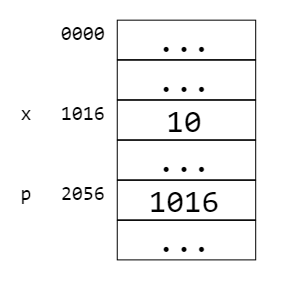
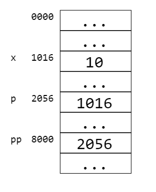

# 1.7 Массивы и указатели

## _2/16 Гуляем по памяти_

__Упражнение.__ Для примера рассмотрим состояние памяти после выделения следующих переменных:
```
int  x = 10;
int* p = &x;
```
Допустим, что `x` находится по адресу 1016, а `p` по адресу 2056. Можно изобразить это следующим образом:



Впишите в пропуски, чему равно значение соответствующего выражения.

### ___Ответ:___

- x == `10`
- &x == `1016`
- &p == `2056`
- p == `1016`
- *p == `10`

---

## _4/16_

Напишите функцию `swap`, которая принимает два указателя на переменные типа `int` и меняет значения этих переменных местами.

Пример ее использования:

```c
// для примера возьмем две переменные и инициализируем их какими-нибудь числами
int x = 10;
int y = 200;

swap( &x, &y ); // теперь x == 200, y == 10
```
Внимание: указатели не обязаны указывать на разные переменные.

__Sample Input:__

1 2

__Sample Output:__

2 1

### ___Ответ:___
```c
void swap(int* a, int* b) {
    int temp = *a; 
    *a = *b;
    *b = temp;
}
```


---

## _5/16_

Напишите функцию `normalize`, которая принимает указатель на __неотрицательное__ число типа `int` и делит его на 2 пока оно четное и положительное.

Например, число 100 станет 25 (100 -> 50 -> 25), число 5 останется собой, число 8 превратится в 1 (8->4->2->1).

Обратите внимание на случай, когда на вход подается 0.

__Sample Input:__

100

__Sample Output:__

25

### ___Ответ:___
```c
void normalize(int* n) {
    while (*n > 0 && *n % 2 == 0) {
        *n /= 2;
    }
}
```


---

## _7/16_

Заполните тело функции, которая принимает число n и с помощью указателей заполняет два числа a и b так, что:


- Если _n_ = 1 или _n_ простое, то положим _a_ = 1, _b_ = _n_.
- Если _n_ составное, то:

$$
\begin{cases}
ab = n \\
1 < a \leq b
\end{cases}
$$

и _a_ наименьший делитель _n_, больший единицы.

Иначе говоря, нужно найти первый из делителей n больших единицы и записать его через указатель `a`.

- Гарантируется, что _n_ > 0.


Вот как можно будет вызвать функцию `factorize`, которую вы напишете:

```c
int var1;
int var2;

factorize(10, &var1, &var2);

// var1 == 2, var2 == 5
```

__Sample Input:__

20

__Sample Output:__

2 10

### ___Ответ:___
```c
void factorize(int n, int* a, int* b) {
    *a = 1;
    *b = n;

    if (n == 1) {
        return;
    }

    for (int i = 2; i <= n / 2; i++) {
        if (n % i == 0) {
            *a = i;
            *b = n / i;
            return;
        }
    }
}
```


---

## _11/16_

Традиционно, есть два способа передачи массивов в функции:

1. Передать указатель на первый элемент и размер массива
2. Передать указатель на начало массива и на элемент ___сразу после последнего___. <br> В этом случае можно пройтись по массиву увеличивая указатель так, что он сначала указывает на первый элемент, затем на второй, и так далее. Когда мы дошли до указателя __за последним элементом__, можно остановиться. <br> Почему передается не указатель на последний элемент, а сразу за ним? Это позволяет передавать массивы нулевой длины:  для них указатель на начало массива будет равен указателю на элемент "сразу за последним".

Напишите две функции, которые переворачивают массив, принимая его первым и вторым способом. В перевернутом массиве элементы идут в обратном порядке, например, массив `10 24 3 4 5` станет `5 4 3 24 10`. Изменить нужно тот массив, который функция получает в качестве аргумента; его не нужно выводить.

### ___Ответ:___
```c
void array_reverse(int* array, int size) {
    for (int i = 0; i < size / 2; i++) {
        int temp = array[i];
        array[i] = array[size - i - 1];
        array[size - i - 1] = temp;
    }
}

void array_reverse_ptr(int* array, int* limit) {
    while (array < limit) {
        limit--; 
        int temp = *array;
        *array = *limit;
        *limit = temp;
        array++; 
    }
}
```


---

## _12/16_

Напишите функцию `array_fib`, которая заполнит массив числами Фибоначчи по порядку.

Функция принимает на вход два аргумента: указатель на начало массива `array` и указатель на элемент сразу после последнего `limit` (см. предыдущий шаг).

Массив нужно заполнить так: первыми двумя числами будут 1 и 1, а каждое следующее является суммой двух предыдущих:

1 1 2 3 5 8 13 ...

Помните, что в массиве может быть любое количество чисел, даже ноль.

### ___Ответ:___
```c
void array_fib(int* array, int* limit) {
    int a = 1;
    int b = 1;
    int* current = array;

    while (current < limit) {
        *current = a;
        current++;
        if (current < limit) {
            *current = b;
            current++;
        }
        a = a + b;
        b = a + b;
    }
}
```


---

## _13/16 Наращиваем уровни косвенности_

Рассмотрим состояние памяти после выделения следующих переменных:

```
int   x  = 10;
int*  p  = &x;
int** pp = &p;
```
Допустим, что `x` находится по адресу 1016, `p` по адресу 2056, `pp` по адресу 8000. Можно изобразить это следующим образом:



Впишите в пропуски, чему равно значение соответствующего выражения.

### ___Ответ:___

- &p == `2056`
- &pp == `8000`
- pp == `2056`
- *pp == `1016`
- **pp == `10`
- pp[0] == `1016`
- pp[0][0] == `10`
- *pp[0] == `10`


---

## _14/16_

Теперь мы увидим типичную ситуацию, при которой функция принимает указатель на указатель. Зачем тут два уровня косвенности?

Иногда из функции нужно вернуть указатель, но возвращать его через `return` неудобно. Рассмотрим функцию `array_min`, которая находит адрес минимального числа в массиве.

```c
// min -- адрес указателя на минимальный элемент в массиве 
// функция возвращает 0 если массив пустой
int array_min(int* array, int* limit, int** min) {
    if (array >= limit) return 0;
    *min = array;
    for( int* cur = array + 1;
              cur < limit; 
              cur = cur + 1 )
    {
       if ( *cur < **min ) {
            *min = cur;
       }
    }
    return 1;
}


int main() {
    int array[] = {4,29,42,2,3};
    int* lmin = NULL;
    // только в том месте, где объявлен массив, мы можем вычислить его длину
    // sizeof(array) вернет длину в байтах
    // sizeof(array[0]) или sizeof(int) -- размер одного элемента
    
    if ( array_min( array, 
                    array + sizeof(array)/sizeof(array[0]), 
                    &lmin ) )
    {
        printf("Min is: %d\n", *lmin );
    } 
    else
    {
        printf("Array is empty\n");
    }
    return 0;
}
```

Минимальный элемент есть только в непустых массивах, поэтому нам надо предусмотреть две ситуации:


- массив пустой, тогда минимума не существует.
- массив непустой, тогда вернём минимальный элемент.


Если мы просто будем возвращать минимальный элемент из функции, мы не сможем сигнализировать о том, что массив был пустым. Чтобы передать в вызывающую функцию больше информации, мы будем возвращать только число типа `int`:


- ноль (ложь), если минимума не существует
- один (истину), если минимум существует. В том случае нам также необходимо передать в вызывающую функцию указатель на минимальный элемент массива. Тип этого указателя `int*`.  Как это сделать, если возвращаемое значение уже занято?

В примере функция `array_min` вызывается из функции main. Создадим в ней переменную `int* lmin`, в которую должен попасть указатель на минимальный элемент массива. Чтобы перезаписать `lmin`  через указатель нужно передать адрес lmin в функцию array_min; адрес lmin имеет тип int**. Отсюда и аргумент `array_min`: `int** min`.

Иными словами, `int** min` это адрес, по которому нужно записать указатель на минимальный элемент массива.

__Упражнение.__ Вам дана функция `predicate`, чью реализацию вы не знаете; вы можете только её вызывать. Вы знаете, что она принимает число и возвращает 0 или 1. Напишите функцию `array_contains`, которая найдёт первый элемент в массиве, который удовлетворяет условию `predicate`.  Как и функция array_min из примера, функция array_contains возвращает 1 если элемент найден, 0 если не найден. Кроме того, через указатель `int** position` она должна вернуть адрес найденного элемента.

### ___Ответ:___
```c
// position -- адрес указателя на первый элемент E в массиве,
// для которого predicate(E) выполняется.
// Функция возвращает 0 если элемент не найден.
int array_contains(int* array, int* limit, int** position) {
    for (int* cur = array; cur < limit; cur++) {
        if (predicate(*cur)) {
            *position = cur; 
            return 1; 
        }
    }
    return 0; 
}
```


---

## _16/16 Строки_

Напишите функции:


- `string_count`: считает длину строки в байтах (не включая нуль-терминатор)
- `string_words`: считает количество слов в строке.

Между словами стоит произвольное количество пробельных символов:


- пробела `' '`
- табуляции `'\t'`
- перевода строки `'\n'`


Пробельные символы также могут стоять в начале или конце строки; __не гарантируется__, что в строке будет хотя бы один символ или хотя бы одно слово.

__Sample Input:__

hello  world

__Sample Output:__

length: 12 words: 2

### ___Ответ:___
```c
int is_whitespace(char c) {
    return c == ' ' || c == '\t' || c == '\n';
}

int string_count(char* str) {
    int count = 0;
    while (*str != '\0') {
        count++;
        str++;
    }
    return count;
}

int string_words(char* str) {
    int count = 0;
    int in_word = 0; 
    while (*str != '\0') {
        if (is_whitespace(*str)) {
            in_word = 0;
        } else {
            if (in_word == 0) {
                count++;
                in_word = 1;
            }
        }
        str++;
    }
    return count;
}
```
