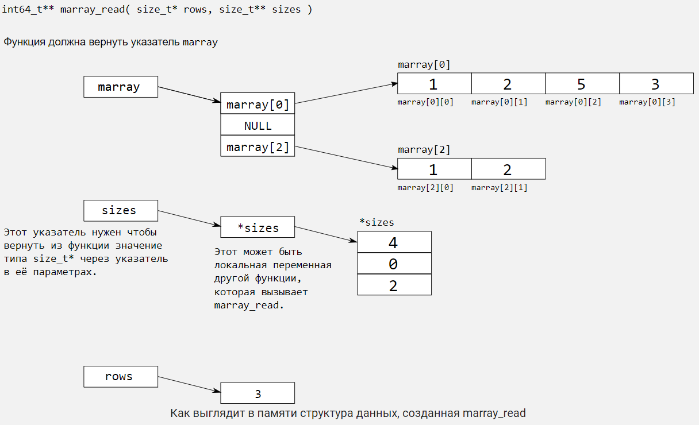
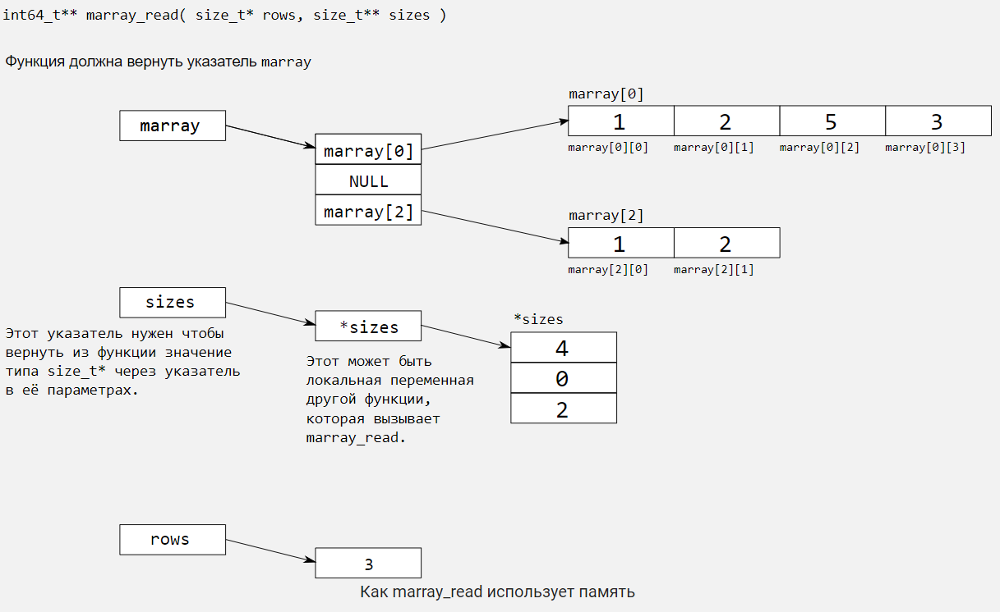

# 2.2 Интерлюдия. Динамическое выделение памяти
## _3/14_

```c
int64_t* array = malloc( 1024 );
if (array) {
   printf("%"  PRId64, array[0] );
}
```

Каким может быть результат выполнения этой программы?

Выберите все подходящие ответы из списка

### ___Ответ:___

- [x] -1
- [x] 1024
- [ ] ошибка
- [x] 0

---

## _4/14_

```c
int64_t* array = malloc( 1024 );
printf("%"  PRId64, array[0] );
```

Каким может быть результат выполнения этой программы?

Выберите все подходящие ответы из списка

### ___Ответ:___

- [x] -1
- [x] 1024
- [x] ошибка
- [x] 0

---

## _7/14_

В этой серии заданий вы реализуете считывание массива заранее неизвестной длины, и поиск в нём минимума.

Начнём со считывания массива.

- Первое число на входе - длина массива, затем идут его элементы.  
    Например, пользователь ввёл числа 3 2 0 43. Это значит, что мы выделим массив на 3 элемента, в который запишем 2 0 43.
- Числа в массиве находятся в диапазоне [−2<sup>63</sup> ; 2<sup>63</sup> − 1]

Напоминаем, что:

- спецификаторы ввода начинаются на `SCN`, например,  `SCNd64` для чисел `int64_t`;
- спецификаторы вывода начинаются на `PRI`, например,  `PRId64` для чисел `int64_t`;
- для  `size_t` спецификаторы ввода и вывода `%zu`.

### ___Ответ:___

```c
int64_t read_int64() {
    int64_t num;
    scanf("%" SCNd64, &num);
    return num;
}

size_t read_size() {
    size_t size;
    scanf("%zu", &size);
    return size;
}

void array_int_fill(int64_t *array, size_t size) {
    for (size_t i = 0; i < size; i++) {
        array[i] = read_int64();
    }
}

int64_t *array_int_read(size_t *size) {
    *size = read_size();
    int64_t *array = (int64_t *)malloc(*size * sizeof(int64_t));
    if (array == NULL) {
        fprintf(stderr, "Memory allocation failed\n");
        exit(1);
    }

    array_int_fill(array, *size);

    return array;
}
```

---

## _8/14_

Теперь реализуйте функцию для поиска минимума в массиве. Аргументы функции --- адрес начала массива и количество элементов в нём.

Функция ничего не считывает со стандартного ввода.

Если минимального элемента в массиве нет, функция возвращает NULL.

Иначе она возвращает адрес любого из минимальных элементов в массиве.

В тестирующей системе ввод начинается с количества элементов в массиве, затем идёт сам массив, как и на предыдущем шаге;

__Sample Input:__

4 8 9 2 3

__Sample Output:__

2

### ___Ответ:___

```c 
int64_t *array_int_min(int64_t *array, size_t size) {
    if (size == 0) {
        return NULL; 
    }

    int64_t *min_element = &array[0]; 
    for (size_t i = 1; i < size; i++) {
        if (array[i] < *min_element) {
            min_element = &array[i]; 
        }
    }

    return min_element;
}
```

---

## _9/14_

Наконец, реализуйте функцию `perform` которая считывает массив со входа, и выводит его минимальный элемент. Если массив пустой, выведите None.

Не забудьте освободить выделенную динамически память.

### ___Ответ:___

```c 
// эти функции вы уже реализовали на предыдущих шагах
int64_t *array_int_read(size_t *size);
int64_t *array_int_min(int64_t *array, size_t size);

// Выводит None если x == NULL, иначе число, на которое указывает x.
void intptr_print(int64_t *x) {
    if (x == NULL) {
        printf("None\n");
    } else {
        printf("%" PRId64 "\n", *x);
    }
}

void perform() {
    size_t size;
    int64_t *array = array_int_read(&size); 

    int64_t *min_element = array_int_min(array, size); 

    intptr_print(min_element); 

    free(array); 
}
```

---

## _10/14 Массив массивов_

Теперь перейдём к другому практически важному случаю - массиву, содержащему указатели на другие массивы. Это разновидность _двумерного массива_, своеобразной таблицы, в которой каждая строчка может иметь разный размер.

Научимся считывать массив массивов чисел `int64_t`.  Формат входа такой:
```
<число строк>
<количество в строке 1> <элемент11> <элемент12> ...
<количество в строке 2> <элемент21> <элемент22> ...
```
Для примера, пусть мы вводим следующие числа:

```
3
4 1 2 5 3
0
2 1 2
```
Тогда массив массивов можно изобразить следующим образом. Обратите внимание на пустую строчку, соответствующую пустому массиву.
```
1 2 5 3

1 2
```
Чтобы работать с массивом массивов придётся создать в памяти достаточно сложную структуру данных:

- выделить массив, хранящий адреса строчек;
- выделить память на каждую строчку;
- выделить память на отдельный массив `sizes`, который хранит длины строчек. Первый элемент массива `sizes` это длина первой строчки, второй -- длина второй и т.д.


Нам пригодится функция из предыдущего задания, вы можете её вызывать.
```c
int64_t* array_int_read( size_t* size );
```
__Sample Input:__

3

9 3 2 4 54 9 2 1 872 123

8 123 12354 23 232 43412 534 8237 -99292

3 45 2 245

__Sample Output:__

3 2 4 54 9 2 1 872 123

123 12354 23 232 43412 534 8237 -99292

45 2 245

### ___Ответ:___

```c 
// Вам доступны эти функции из прошлых заданий
size_t read_size();
void array_int_fill( int64_t* array, size_t size );
int64_t* array_int_read( size_t* size );

int64_t** marray_read(size_t* rows, size_t** sizes) {
    *rows = read_size(); 
    *sizes = (size_t*)malloc(*rows * sizeof(size_t)); 
    int64_t** marray = (int64_t**)malloc(*rows * sizeof(int64_t*)); 

    for (size_t i = 0; i < *rows; i++) {
        marray[i] = array_int_read(&((*sizes)[i])); 
    }

    return marray;
}


void marray_print(int64_t** marray, size_t* sizes, size_t rows) {
    for (size_t i = 0; i < rows; i++) {
        for (size_t j = 0; j < sizes[i]; j++) {
            printf("%" PRId64 " ", marray[i][j]);
        }
        printf("\n");
    }
}
```

---

## _11/14_

Массив массивов нужно уметь освобождать. Недостаточно вызвать для него `free`, потому что каждая строка выделялась отдельно.

Реализуйте функцию для освобождения памяти под динамический массив массивов, такой, какой был показан на предыдущем слайде.



__Sample Input:__

3

9 3 2 4 54 9 2 1 872 123

8 123 12354 23 232 43412 534 8237 -99292

3 45 2 245

__Sample Output:__

3 2 4 54 9 2 1 872 123

123 12354 23 232 43412 534 8237 -99292

45 2 245

### ___Ответ:___

```c 
void marray_free(int64_t** marray, size_t rows) {
    for (size_t i = 0; i < rows; i++) {
        free(marray[i]); 
    }
    free(marray); 
}
```

---

## _12/14_

Наконец, сделаем что-нибудь интересное с массивом массивов.

1. Считаем массив массивов;
2. Найдем минимальный элемент _M_ (один на весь массив массивов);
3. Вычтем _M_ изо всех элементов массива массивов;
4. Выведем результат.

Вы можете использовать функции из предыдущих заданий.

Возможна ситуация, когда массив массивов состоит только из пустых строчек.

Для напоминания: массив массивов представляется в памяти для функции `marray_read` вот так:




### ___Ответ:___

```c 
// Вам доступны следующие функции:
size_t read_size();
int64_t* array_int_min( int64_t* array, size_t size );
int64_t** marray_read( size_t* rows, size_t* sizes[] );
void marray_free( int64_t** marray, size_t rows );
void marray_print(int64_t** marray, size_t* sizes, size_t rows);


// Указатель на минимальное из двух чисел.
// если хотя бы одно число NULL, то возвращать второе
// если оба числа NULL результат NULL
int64_t* int64_ptr_min(int64_t* x, int64_t* y) {
    if (x == NULL) {
        return y;
    } else if (y == NULL) {
        return x;
    } else {
        return (*x < *y) ? x : y;
    }
}

int64_t* marray_int_min(int64_t** marray, size_t* sizes, size_t rows) {
    int64_t* min_element = NULL;

    for (size_t i = 0; i < rows; i++) {
        if (sizes[i] > 0) {
            min_element = int64_ptr_min(min_element, array_int_min(marray[i], sizes[i]));
        }
    }

    return min_element;
}

void marray_normalize(int64_t** marray, size_t sizes[], size_t rows, int64_t m) {
    for (size_t i = 0; i < rows; i++) {
        for (size_t j = 0; j < sizes[i]; j++) {
            marray[i][j] -= m;
        }
    }
}


// Прочитать, найти минимум и нормализовать массив, вывести результат
void perform() {
    size_t rows;
    size_t* sizes;
    int64_t** marray = marray_read(&rows, &sizes);

    if (marray == NULL) {
        printf("None\n");
        return;
    }

    int64_t* min = marray_int_min(marray, sizes, rows);

    if (min != NULL) {
        marray_normalize(marray, sizes, rows, *min);
    }

    marray_print(marray, sizes, rows);

    for (size_t i = 0; i < rows; i++) {
        free(marray[i]);
    }
    free(marray);
    free(sizes);
}
```
